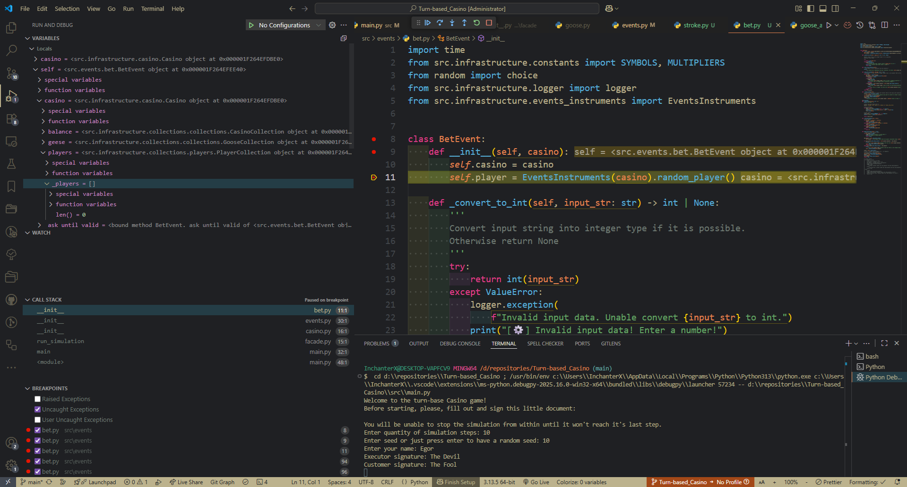
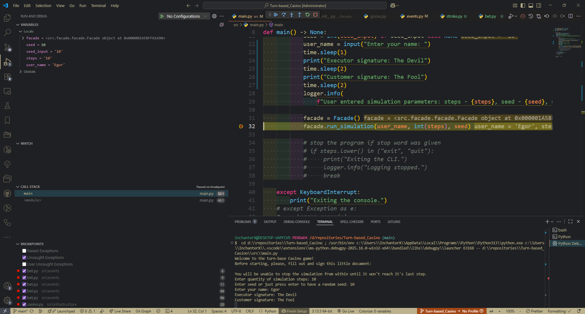
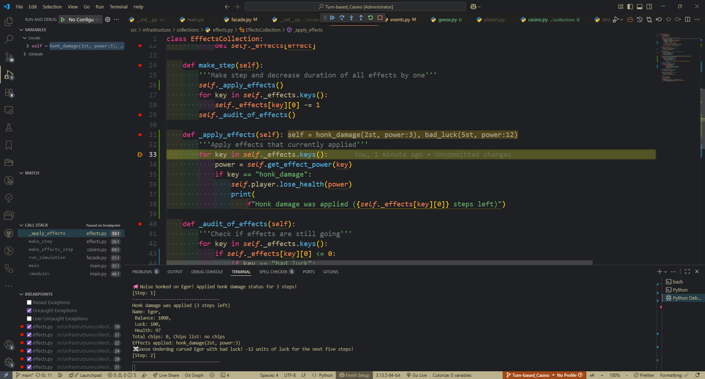
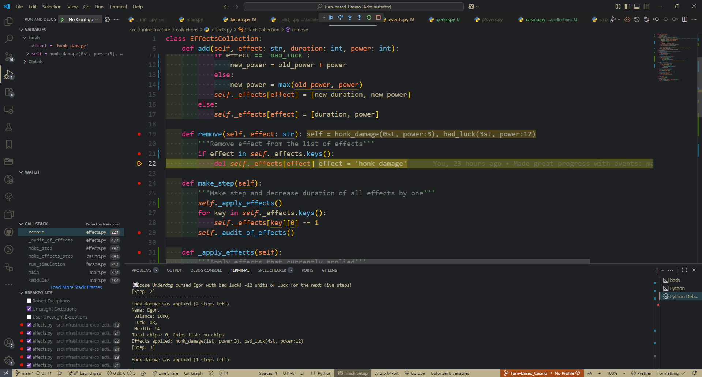
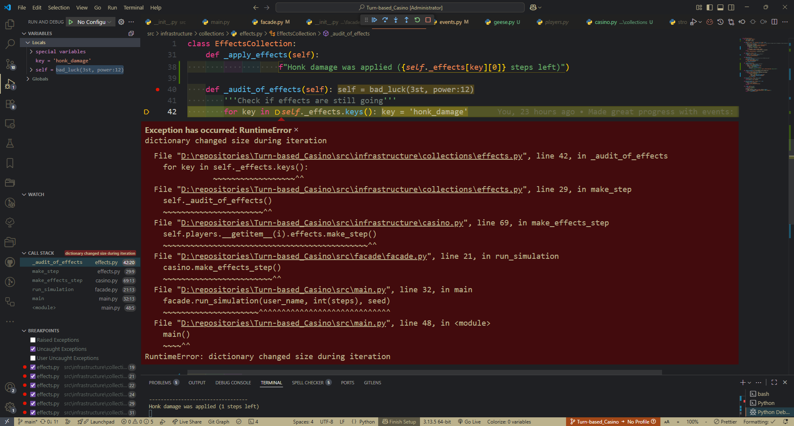
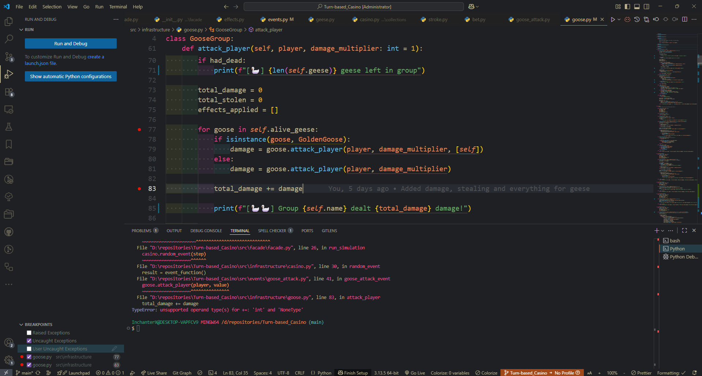
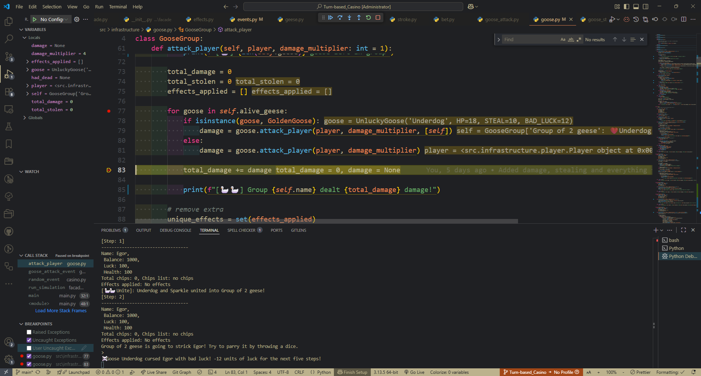
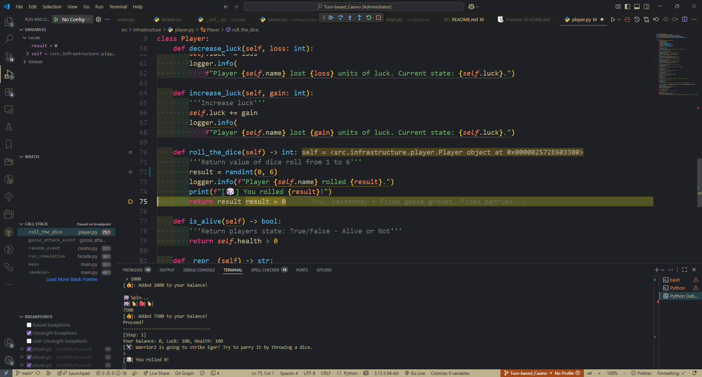
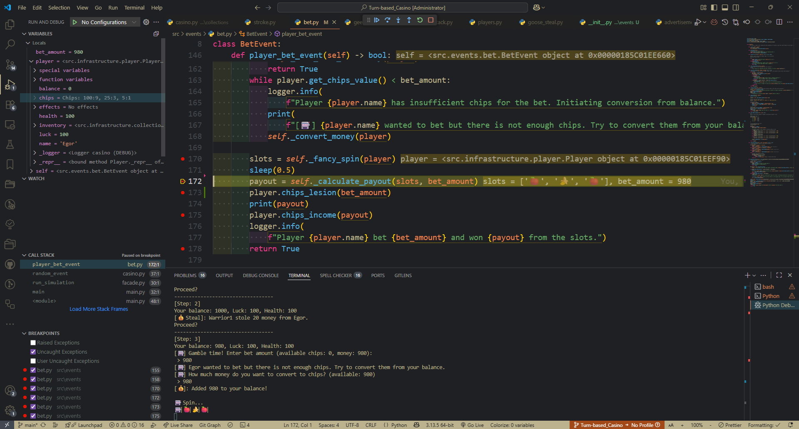

<pre>
.
    ├── Turn-base_Casino
    │   ├── .casino_log/                       # project logs
    │   ├── src/                               # Source code
    │       ├── common/                        # main functions of the console
    │            ├── __init__.py               #
    │            ├── config.py                 # logging config
    │       ├── events/                        # folder with all random events
    │            ├── advertisement.py          # advertisement break
    │            ├── bet.py                    # allow player to make a bet in roulette
    │            ├── geese_unite.py            # execute random goose unite
    │            ├── goose_attack.py           # execute random goose attack
    │            ├── goose_steal.py            # execute random goose steal
    │            ├── stroke.py                 # hit player with a stroke
    │       ├── facade/                        # place to gather everything
    │            ├── __init__.py               #
    │            ├── facade.py                 # file for simpler usage of program functional
    │       ├── infrastructure/                # folder with main program files
    │            ├── collection/               # folder with all collections
    │                 ├── casino.py            # casino collection
    │                 ├── chips.py             # player's chip and chips balance collections
    │                 ├── effects.py           # player's effects collections
    │                 ├── geese.py             # casino geese collection
    │                 ├── players.py           # casino players collections
    │            ├── __init__.py               #
    │            ├── casino.py                 # casino class with it functional
    │            ├── constants.py              # constants
    │            ├── events_instruments.py     # random players and geese selector
    │            ├── events.py                 # chose a random event
    │            ├── geese.py                  # geese classes
    │            ├── logger.py                 # just a logger
    │            ├── players.py                # casino players class
    │       ├── __init__.py                    #
    │       ├── main.py                        # it is the main file
    │   ├── tests/                             # Code tests
    │   ├── .gitignore                         # git ignore files
    │   ├── .pre-commit-config.yaml            # Code-style check
    │   ├── pyproject.toml                     # Project configuration
    │   ├── README.md                          # Laboratory report with a project description
</pre>

# Set up
To use this package you need to download it. Then you can run it from the project root with your terminal with:
```
python -m src.main
```

## Tests
To run tests you need to have pytest, pytest-cov.
To activate tests use:
```
python -m pytest
```

# How it works? (flow)
These program is a random turn-based casino. Player write it's parameters to the CLI and then play it for N steps, by participating in radom events pulled based on the seed.

## Logger
One logger that used across the project. It gather everything that happened within the projects to the .casino_log folder in the root folder of the project.

## Main
Main file where program starts. It inform player about the simulation rules and ask to enter all parameters, that needed to start a simulation. Then it convey them to the facade.

## Facade
Facade make life easer by separating simulation logic from main file. It run simulation based on the given parameters by iterating for given amount of steps, calling for random events for casino instance and all that exists in it.

## Casino
Casino is a core class of the simulation. It gather instances of players, geese and self collections. It functions: register players in the beginning of simulation, peaking random event from the list of events, checking statuses of players and geese in the casino and processing effects. Basically it is a place where simulation heart lay.

Lets go one by one.

## Collections
### Casino collection
Collection that describe casino balance, can increase or decrease it.

### Chips
Chips are split to two collections: chip and chips.

Chip collection describe one denomination of chips, supports adding and subtracting with magical methods. Also can return total value of it chips.

Chips collection is a dictionary collection that store chip, chip, chip and chip - instances of chip collections with different denomination. It can work with them by adding, removing and returning info about them. But the core function of it is exchanging of chips of one denomination to another.

### Geese
Geese collection is an example of list collection. It stores all the geese in the casino. It supports iterations and length finding via to magic methods implemented in it. Geese can be appended or removed.

### Players
Players collection is pretty similar to the geese collection, but it stores casino players. In base situations it is one player, that player the game in the CLI.

### Effects
Effects collection stores players effects. It is dictionary-based and stores all unique effects assigned to player. Effects can be added or removed, can be executed. Collection have a functional of decreasing duration of effects with every step, so when they will expire, they will be removed.

## Player
Player have it own class with it own balance and other parameters. Instances ofo chips and effects collections are assigned to hte player. Player have balance of chips and balance of money and can exchange them to play casino. Player also can lose or gain HP points, gain or lose luck points that effect spin results. Also, player can roll a dice, that is used in the situations where something want to damage a player.

## Goose
There are basically 6 types of geese.
### Basic goose
Basic goose describe all default parameters of all the geese. It is a parent class but it also a combat unit. It can attack player (by throwing a dice player can block or even parry goose's damage), still from player and can be summed. ...
Goose can unite to a group, that mechanics is implemented using magical method \_\_add__.

### Group of geese
Groups also can be summed with each other or with a single goose. They execute all actions of the geese, that participate in the group, have total damage, health and everything.

### War Goose
War goose is a child-class of basic goose. The difference is that it can execute critical damage with x2 multiplier of damage. And basically have more damage.

### Honk goose
Honk goose apply damage effects of "honk" that longs 3 steps and constantly damage players. It is stores in the player's effects collection.

### Unlucky goose
Unlucky goose is a good stealer and ruiner. It timely lower players luck.

### Golden goose
Golden goose is an imposter. Instead of dealing damage to a player it will steal money from its' colleagues and share with player.

## Events
Events class gather all events and provide a very important function that allow casino and simulation to run a random event.

## Events instruments
Small helper that allow events to pull a random player or geese within a casino.

## Events (folder)
A separate folder with all the events that can appear in the game.

### Advertisement
Event that rise an advertisement to the CLI from the list of advertisements, stored in the constant in constants.

### Bet
Core casino event that allow player to gamble as mad. It ask player to enter bet amount, if player have not enough chips it will ask to convert them from money. After bet is made it will play an animation of spinning roulette and will count a result. Result of the roulette is based on basic parameters, but luck of player increase chances to win.

### Geese unite
Event that execute geese "summing". I like this word.

### Goose attack
Execute random goose attack on random player. That's all.

### Goose steal
Similarly to the attack event it execute random goose stealing from random player.

### Stroke
My favorite random event that just deal 100% of players HP. It is really rare and can be partially blocked with dice roll.

## Constants
Honorable mentioned - constants file with constants.

# Bugs fixing using debugging tools
Here is 5 cases of solving a problem in project using debug tools.
## Mistake 1
Place: bet.py, geese_unite.py and other, method \_\_init__

Symptoms: When starting a simulation, events cannot start due to a lack of players.
How to reproduce: Run simulation with any seed, enter data.

Debug: A breakpoint was set on \_\_init__ in the BetEvent class, as an example event. An empty player array was detected. Several breakpoints were set to trace the user creation path. The user is created correctly. The problem is in self.player = EventsInstruments(casino).random_player()

Reason: The problem is that instances are constantly being created, even though the user is added only once. The line has been replaced with self.instruments = EventsInstruments(casino)
The functions have been further adjusted to work with the new correct version.

Check: Simulation behaves as expected.

Proves:



## Mistake 2
Place: effects.py, remove function

Symptoms: During the simulation, the program catches a general error "dictionary changed size during iteration" after the end of the goose effect.
How to reproduce: Run the simulation, spend enough time in it to get the goose effect and wait for it to disappear.

Debug: Breakpoints are set in the make_step function, the _apply_effects and _audit_of_effects functions it uses, and the remove function. This records whether effects are applied correctly, their durations are reduced, and the moment when they should be removed is recorded. During iteration in _audit_of_effects, remove removes the effect with the elapsed duration.

Reason: This action disrupts dictionary iteration in _audit_of_effects. To fix this, first iterate through the dictionary, collecting elements to be deleted. Then, they are deleted.

Check: Simulation behaves as expected.

Proves:




## Mistake 3
Place: goose.py, GooseGroup class, attack_player() function

Symptoms: When a group of geese attacks, a TypeError error occurs: unsupported operand type(s) for +=: 'int' and 'NoneType'

How to reproduce: Run the simulation with seed=10, reach step 3, roll the dice.

Debug: A breakpoint is set on the line mentioned in the error, as well as on the loop in which it is used, the fact of the lack of return of damage from the attack of geese is recorded, the omission is identified.

Reason: The goose attack function performs the actions, but does not return the damage value, which results in None being added.

Check: Simulation behaves as expected.

Proves:




## Mistake 4
Place: player.py, function roll_the_dice

Symptoms: Player roll impossible 0 value on dice during parring.

How to reproduce: Start a simulation with seed 42, play until second (step 1) step.

Debug: A breakpoints are placed in the function roll_the_dice to detect were wrong value appear.

Reason: Wrong range of randint function that includes values on both ends.

Check: Simulation behaves as expected.

Proves:


## Mistake 5
Place: bet.py, function player_bet_event

Symptoms: During manipulation with players balance critical vulnerability appear - bet is made and calculated, but money are still not withdrew.

How to reproduce: Start a simulation with seed 52, play until fifth (step 4) step. Gamble a roulette.

Debug: A breakpoints are placed in the function player_bet_event to detect were vulnerability appear. Check variables during execution.

Reason: Wrong order of operation within the functions. Money must be withdraw first, only then result can be calculated.

Check: Simulation behaves as expected.

Proves:


